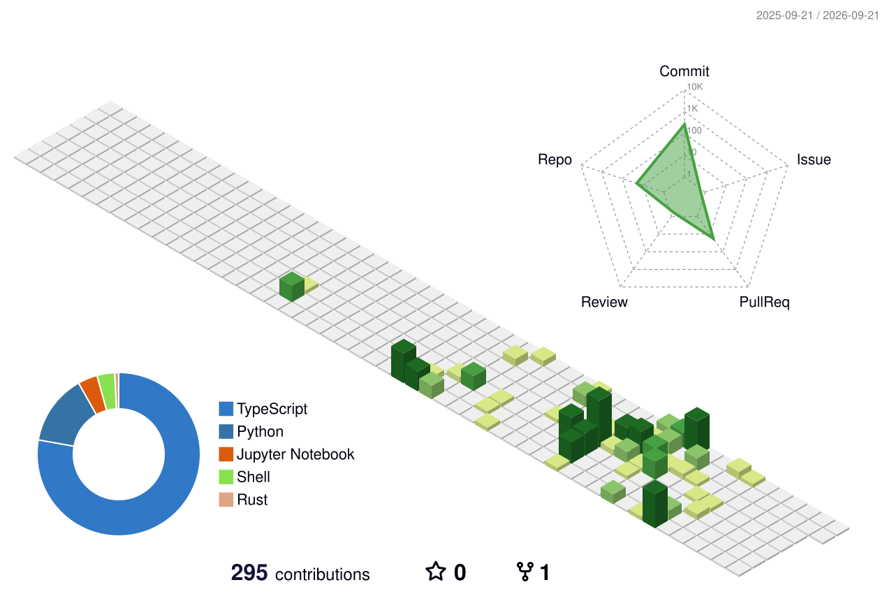

<!--
  ═══════════════════════════════════════════════════════════════
   VrajVaghela · GitHub Profile README
  ═══════════════════════════════════════════════════════════════
   NOTE: GitHub sanitizes README HTML. No <script>, no <style>,
   no CSS classes. All animation arrives as pre-animated SVG.

   See SETUP.md for any additional customization steps.
  ═══════════════════════════════════════════════════════════════
-->

 

---

## 🧠 About

I'm a Computer Science student who learns by shipping. Most of what I build sits at the
intersection of **LLM agents and real systems** — tools that plan, retrieve, and act rather
than just autocomplete.

- 🔬 Deep in **agentic workflows, RAG pipelines, and multi-agent orchestration** — Corrective RAG and Self-RAG implementations, LangChain/LangGraph, plus an agentic platform built for a hackathon.
- 🦀 Also drawn to the layer underneath: a **packet-filtering firewall in Rust** and a **network intrusion detection** project keep me honest about what's actually happening on the wire.
- 🚀 I ship end-to-end — **TypeScript/Next.js** front to back, **Python** for the ML side, deployed and publicly reachable.
- 🤝 Open to collaborating on AI tooling, developer experience, and anything agentic.

  

---

## ⚡ Tech Arsenal

**Languages**

**Frameworks & Runtime**

**AI / Data**

**Tooling & Infra**

`LangChain` · `LangGraph` · `Clerk` · `Liveblocks` · `Trigger.dev` · `React Native` · `Jupyter`

---

## 🚀 Featured Work

<table>
<tr>
<td width="50%" valign="top">

### 🛡️ CrimeOS

**Intelligence-led police investigation platform.** Agentic AI covering the full case
lifecycle: multilingual complaint ingestion (Gujarati PDFs, Hindi audio, handwritten FIR
scans), SOP-grounded investigation paths, automated legal drafting, and audit-transparent
case summaries. Built for the **ERH26 Hackathon**.

`TypeScript` `Agentic AI` `Multimodal`

[**Explore →**](https://github.com/VrajVaghela/CrimeOS)

</td>
<td width="50%" valign="top">

### 👻 Ghost AI

**Interactive systems-architecture builder.** Design and reason about system diagrams
collaboratively, with real-time presence and background job orchestration.

`Next.js` `Liveblocks` `Clerk` `Trigger.dev`

[**Live Demo ▸**](https://ghost-ai-rho.vercel.app/sign-in) · [**Code →**](https://github.com/VrajVaghela/ghost_ai)

</td>
</tr>
<tr>
<td width="50%" valign="top">

### 📈 FinSight

**Financial analysis and insight engine.** Python pipeline for ingesting market data and
surfacing signal — the analytical sibling to my algorithmic-trading experiments.

`Python` `Data Analysis` `Finance`

[**Explore →**](https://github.com/VrajVaghela/FinSight)

</td>
<td width="50%" valign="top">

### 🔧 gitassist

**AI assistant for Git workflows.** Reduces the friction between intent and the right
command — built because I kept reaching for the same handful of incantations.

`TypeScript` `Developer Tooling` `LLM`

[**Explore →**](https://github.com/VrajVaghela/gitassist)

</td>
</tr>
<tr>
<td width="50%" valign="top">

### 🦀 firewall

**Packet-filtering firewall written in Rust.** A deliberate step down the stack: rule
evaluation and packet inspection without a garbage collector in the way.

`Rust` `Networking` `Systems`

[**Explore →**](https://github.com/VrajVaghela/firewall)

</td>
<td width="50%" valign="top">

### 🎓 autoclassroom

**Homework automation agent.** Point it at an assignment and it works the problem
end-to-end. Equal parts useful tool and study of agent reliability.

`Python` `Automation` `LLM Agents`

[**Explore →**](https://github.com/VrajVaghela/autoclassroom)

</td>
</tr>
</table>

<b>📂 More projects — AI research, trading, and tooling (click to expand)</b>

 

**Agentic AI & RAG**

| Project | What it is | Stack |
| :--- | :--- | :--- |
| [`jobpilot`](https://github.com/VrajVaghela/jobpilot) | AI job-search agent — role matching, tailored resumes, faster applications | `TypeScript` |
| [`agent`](https://github.com/VrajVaghela/agent) | Agent scaffolding and experiments | `TypeScript` |
| [`crag`](https://github.com/VrajVaghela/crag) | Corrective RAG implementation | `Python` |
| [`selfrag`](https://github.com/VrajVaghela/selfrag) | Self-RAG — retrieval with self-critique | `Python` |
| [`chatbot`](https://github.com/VrajVaghela/chatbot) | Conversational agent groundwork | `Python` |
| [`lagnchain-langgraph-tutorials`](https://github.com/VrajVaghela/lagnchain-langgraph-tutorials) | LangChain / LangGraph working notes | `Jupyter` |

**Products & Platforms**

| Project | What it is | Stack |
| :--- | :--- | :--- |
| [`Command-Bot`](https://github.com/VrajVaghela/Command-Bot) | Command-driven bot — [live ▸](https://command-bot.vercel.app) | `TypeScript` |
| [`odoo-hackathon`](https://github.com/VrajVaghela/odoo-hackathon) | TransitOps — smart transport operations platform | `TypeScript` |
| [`vocaba`](https://github.com/VrajVaghela/vocaba) | Vocaba/Lingua — language learning | `React Native` `Clerk` |
| [`nodebase`](https://github.com/VrajVaghela/nodebase) | Node-based workspace experiment | `TypeScript` |

**Quant & ML**

| Project | What it is | Stack |
| :--- | :--- | :--- |
| [`algotrading`](https://github.com/VrajVaghela/algotrading) | Algorithmic trading strategies | `Python` |
| [`algoX`](https://github.com/VrajVaghela/algoX) | Algorithm visualization and practice | `TypeScript` |
| [`DSlab_Project_Network_Intrusion_detection...`](https://github.com/VrajVaghela/DSlab_Project_Network_Intrusion_detection_Kirtan_Sodagar_U23CS051) | Network intrusion detection — Data Science lab | `Jupyter` |

---

## 📊 GitHub Stats

<!--
  The metrics panel below is DISABLED until METRICS_TOKEN exists, otherwise it
  renders as a broken image. To enable: add the secret (SETUP.md step 5), run the
  "Generate Metrics" workflow, then delete these two comment markers.

  Deliberately NOT using github-readme-stats.vercel.app - it returns
  503 DEPLOYMENT_PAUSED. The cards below need no token and are verified working.

-->

### 📈 Contribution Activity

---

## 🐍 Watch the Snake Eat My Contributions

<!--
  Generated by .github/workflows/snake.yml (Platane/snk) into the `output` branch.
  Animation lives inside the SVG as @keyframes, which survives GitHub's image proxy.
  Appears after the first Actions run.
-->
<picture>
  <source media="(prefers-color-scheme: dark)" srcset="https://raw.githubusercontent.com/VrajVaghela/VrajVaghela/output/snake-dark.svg" />
  <source media="(prefers-color-scheme: light)" srcset="https://raw.githubusercontent.com/VrajVaghela/VrajVaghela/output/snake-light.svg" />
  
</picture>

<b>🏙️ See my contributions as a 3D city (click to expand)</b>

 

<!-- Generated by .github/workflows/3d-contrib.yml — appears after first Actions run. -->
<picture>
  <source media="(prefers-color-scheme: dark)" srcset="./profile-3d-contrib/profile-night-view.svg" />
  
</picture>

---

### 💬 Let's build something

Open to collaboration on **AI agents**, **developer tooling**, and **systems work**.

  

<i>⭐ If something here is useful to you, a star means a lot.</i>

